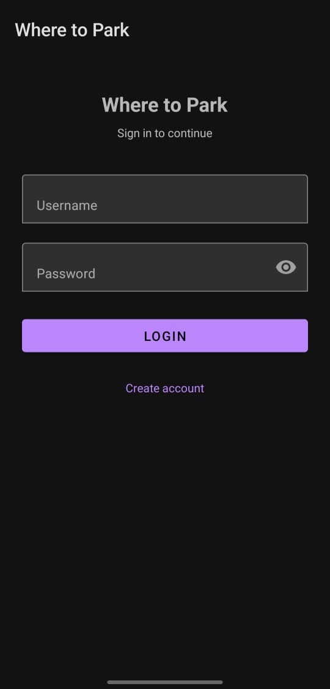
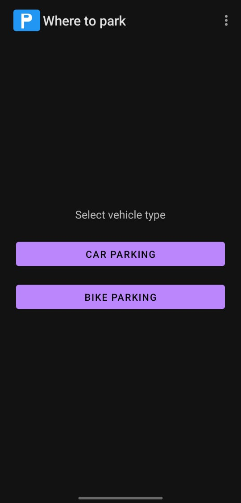
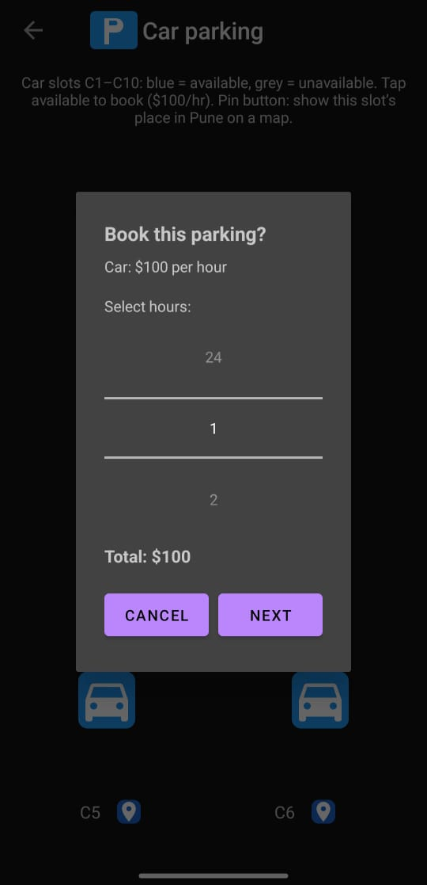
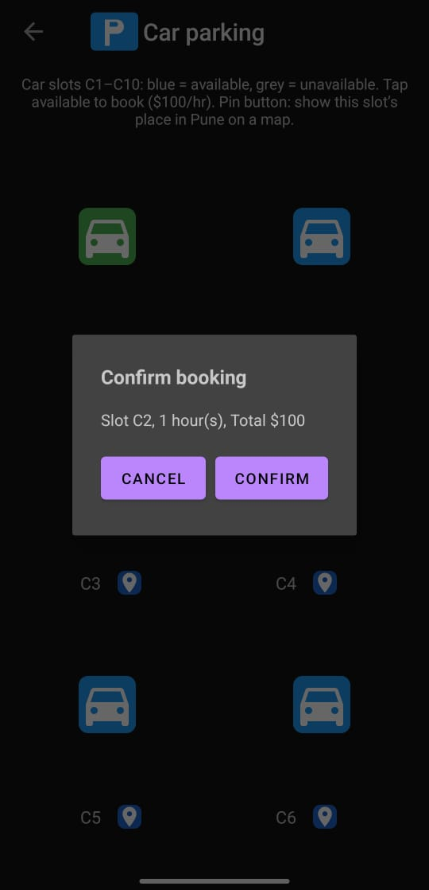
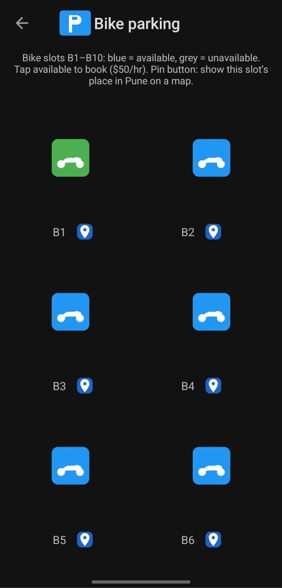
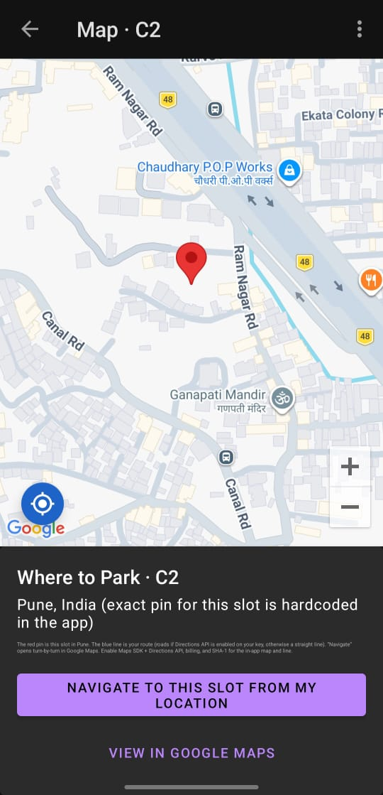
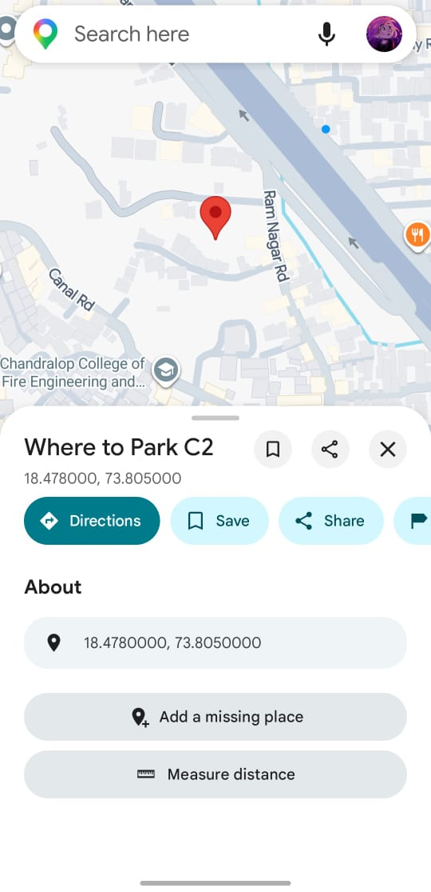

# 🅿️ Where to Park

An Android app for finding and booking parking slots for Cars and Bikes, with Google Maps integration and Firebase backend.

---

##  Features

-  **Login & Register** — Firebase Authentication for secure user sign-in and account creation
-  **Car Parking** — 10 car slots (C1–C10), colour-coded for availability — ₹100/hr
-  **Bike Parking** — 10 bike slots (B1–B10), colour-coded for availability — ₹50/hr
-  **Slot Map View** — Tap the pin on any slot to see its exact location on Google Maps
-  **Navigate to Slot** — Get turn-by-turn directions from your current location
-  **Hour-based Booking** — Select hours, see live total, confirm booking in one flow
-  **Live Slot Status** — Green= booked by you, Blue = available, Grey = taken
-  **Admin Panel** — Admins can register vehicles and manage the parking system
-  **Firebase Realtime DB** — Slot availability syncs in real time across all users

---

##  Tech Stack

| Component | Technology |
|-----------|------------|
| Language | Java |
| UI | XML Layouts |
| Auth | Firebase Authentication |
| Database | Firebase Realtime Database |
| Maps | Google Maps SDK for Android |
| Build | Gradle |
| IDE | Android Studio |

---

##  Project Structure

```
WhereToParkProject/
│
├── app/
│   ├── src/main/
│   │   ├── java/com/example/wheretoparkproject/
│   │   │   └── activities/
│   │   │       ├── LoginActivity.java          ← App entry point & Firebase login
│   │   │       ├── RegisterActivity.java        ← New user registration
│   │   │       ├── VehicleSelection.java        ← Choose Car or Bike parking
│   │   │       ├── CarSlotSection.java          ← Car slots grid (C1–C10)
│   │   │       ├── BikeSlotSection.java         ← Bike slots grid (B1–B10)
│   │   │       ├── VehicleNo.java               ← Enter vehicle number before booking
│   │   │       ├── ParkingMapActivity.java      ← In-app Google Maps for a slot
│   │   │       ├── AdminChoice.java             ← Admin dashboard
│   │   │       ├── AdminVehicleRegistar.java    ← Admin vehicle registration
│   │   │       └── About.java                  ← App info screen
│   │   │
│   │   ├── res/
│   │   │   ├── layout/                         ← All XML UI layouts
│   │   │   ├── values/
│   │   │   │   ├── strings.xml                 ← App strings
│   │   │   │   ├── colors.xml                  ← Color palette
│   │   │   │   └── themes.xml                  ← App theme
│   │   │   └── xml/
│   │   │       ├── backup_rules.xml
│   │   │       └── data_extraction_rules.xml
│   │   │
│   │   └── AndroidManifest.xml                 ← Permissions, activities, Maps API key
│   │
│   └── build.gradle                            ← App-level dependencies
│
├── screenshots/                                ← App screenshots
├── build.gradle                                ← Project-level Gradle config
├── local.properties                            ← 🔒 API keys (NOT committed to Git)
├── google-services.json                        ← 🔒 Firebase config (NOT committed to Git)
└── .gitignore
```

---

##  Permissions

| Permission | Why it's needed |
|------------|-----------------|
| `INTERNET` | Firebase & Maps network calls |
| `ACCESS_NETWORK_STATE` | Check connectivity before requests |
| `ACCESS_WIFI_STATE` | Wi-Fi state detection |
| `WRITE_EXTERNAL_STORAGE` | Save local data |
| `READ_EXTERNAL_STORAGE` | Read local data |
| `RECEIVE_BOOT_COMPLETED` | Restart background tasks on reboot |
| `READ_PHONE_STATE` | Device identification |
| `ACCESS_COARSE_LOCATION` | Approximate location for nearby slots |
| `ACCESS_FINE_LOCATION` | Precise GPS for navigation |

---

##  License

This project is licensed under the MIT License. See the [LICENSE](LICENSE) file for details.

---

##  Screenshots

| Login | Vehicle Select | Car Slots |
|:-----:|:--------------:|:---------:|
|  |  |  |

| Book Hours | Confirm Booking | Bike Slots |
|:----------:|:---------------:|:----------:|
|  |  |  |

| In-App Map | Google Maps View |
|:----------:|:----------------:|
|  |  |

---
## Author

**Ariba Khan**

